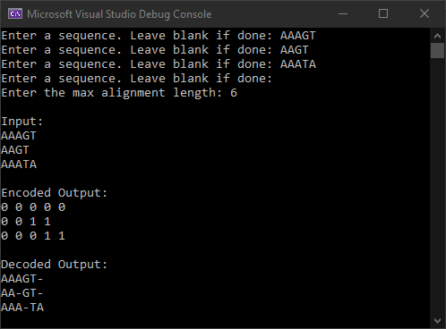
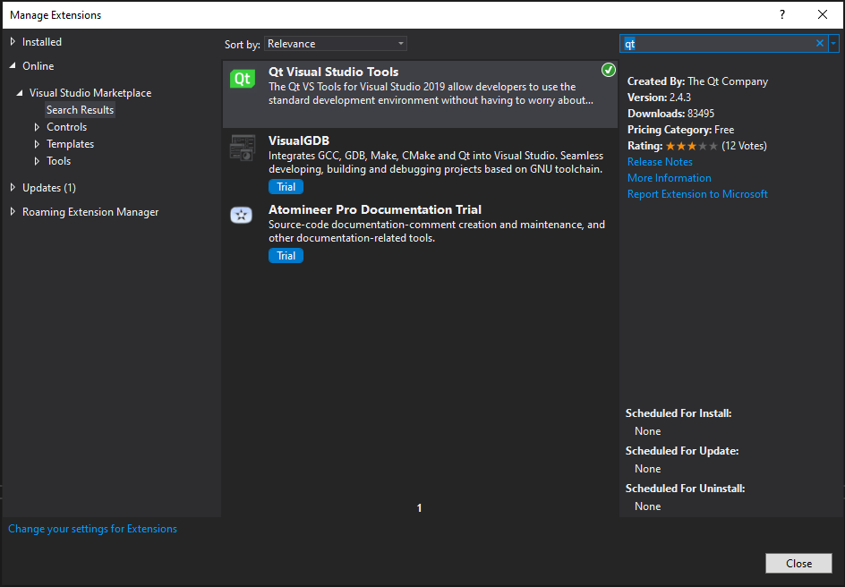
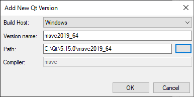

# MSA-SMT
A project for CS 517, Theory of Computation at Oregon State University.

## About
MSA-SMT is a tool that aligns multiple sequences of DNA or RNA using the [Z3 Prover](https://github.com/Z3Prover/z3) as a backend. The tool formulates multiple sequence alignment (MSA) as a satisfiability modulo theory (SMT) problem which can be solved (somewhat efficiently) by Z3.

## Pre-built Binaries
Most users should just get the pre-built binaries found in [releases](https://github.com/tigerman9854/MSA-SMT/releases). Simply install the tool, and follow the instructions in the release.

## Compiling
This section is for developers.

### Command Line Version
1. Clone the repository.
2. Open "MSA-SMT/MSA-SMT.sln" in Visual Studio 2019.
3. Set "MSA-CMD" as the startup project.
4. Press F5 to build and run:

### User Interface Version

#### 1. Install Qt
1. Download the Qt Online Installer from the bottom of this page: https://www.qt.io/download-open-source
2. Run the installer. Create a free account and verify your email.
3. Choose C:\Qt as the installation folder. This will guarantee the path length does not exceed the Windows limit.
4. Select the latest release "Qt 6.1.x", and only download the binaries for "MSVC 2019 64-bit". Downloading for other platforms takes a lot of space and time.

#### 2. Install QT VS Tools
1. Open Visual Studio 2019
2. Navigate to Extensions > Manage Extensions. Search for Qt.

3. Install the extension.
4. Restart Visual Studio.

#### 3. Set the Qt Path
1. Open Visual Studio 2019
2. Navigate to Extensions > Qt VS Tools > Qt Options.
3. Add a Qt Version so Visual Studio knows where to look for Qt files. IMPORTANT: To allow all contributors to compile without reconfiguring Qt, please name your Qt version exactly "msvc2019_64".

#### 4. Build
1. Clone the repository.
2. Open "ModelViewer/ModelViewer/ModelViewer.sln" using Visual Studio 2019.
3. Press F5 to build and run.
